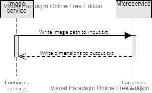

# CS361 Microservice
Microservice that checks if a file exists, and if it is an image it writes its dimensions to another file.

## What it does
This service continuously runs as a process from the terminal and continuously checks the file located adjascent to it titled `input.txt`. If it locates a path to an existing `.png` or `.jpg` file, it will write the dimensions of that file to `output.txt`.

## Steps for inclusion
1. Clone this repository anywhere on your machine where you can easily access `input.txt` and `output.txt`.
2. Run `pip install pillow` where you choose to run the microservice. This installs a module that the service uses to find the dimensions of an image file.
3. Run `python file_exists_service.py` in the directory you cloned to.
4. Type "exit" into `input.txt` to safely close the service when you are finished.

## Sequence diagram


## Requesting data
- To request data, write the path to an image in `input.txt`. This can be done either with another program or manually.
- If the path written in `input.txt` is valid, the service will write the dimensions to it in `input.txt`.

### Example in Python
```python:
input_file.write('image.png')   # dimensions are 480x480, input_file is input.txt
time.sleep(2)                   # wait for service to get data from file
output_file.read('output.txt')  # output.txt should read, "exists, 480, 480"
```

## Receiving data
- To receive data from this service, simply read from `output.txt`.
- If the service successfully finds a `.png` or `.jpg` file, text in the form `exists, {width}, {height}` will be written to `output.txt`, with `{width}` and `{height}` being replaced with the width and height of the image.
